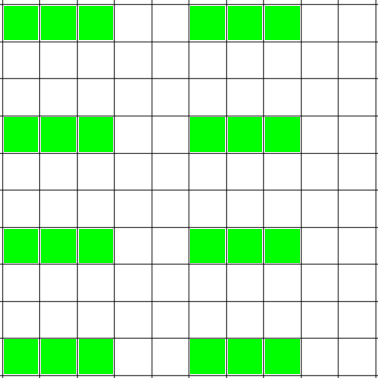
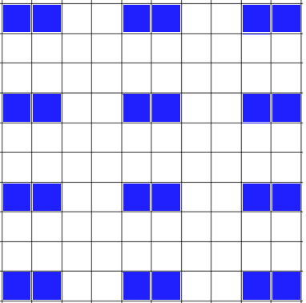
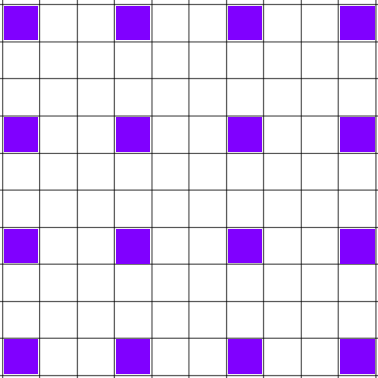

Проект:
    Реализация игры "Морской Бой" на python. Автор: Хатымов Ренат, Б05-224.
По поводу багов и ошибок писать на: t.me/renatxat

Установка:

Light:
1) Pyinstaller.
Запустите файл sea-battle.exe из папки /game/windows, если у вас windows.
Зайдите в коносли в папку /game/linux и пропишите:
sudo chmod +x sea-battle && ./sea-battle
если у вас linux.
Воспользуйтесь другим способом, если у вас macos. 

Medium:
1) Docker. Скачайте sea-battle.tar из /game/docker.
2) Распакуйте его при помощи docker load <sea-battle.tar
3) Запустите полученный образ:
docker run -i -t --rm -e DISPLAY=$DISPLAY -v /tmp/.X11-unix:/tmp/.X11-unix:ro --name="rdev" sea-battle

Hard:
0) Установите python 3.10+ (иначе у вас могут вылетать ошибки в консоль)
1) Запустите файл server.py при помощи команды:
python3.10 server.py
2) Поменяйте значение параметра HOST в файле config.py на 'localhost',
если хотите запустить сервер локально (удалённый может не работать)
3) Пропишите в терминале:
pip install -r requirements.txt
Если у вас linux, то скачайте ещё модуль tkinter при помощи следующих команд:
sudo apt update
sudo apt install python3-tk
4) Запустите файл main.py при помощи команды:
python3.10 main.py

        Основная логика:

        При запуске main.py создаётся объект класса Menu, появляются кнопки, нажатиями на которые
    вы можете выбрать режим игры.
     1. Если вы выберете режим игры с ботом, то далее можно выбрать, кто будет ходить первым.
    Запускается класс Application из application_game_with_bot.py, в нём запускается
    класс ConstructorFields, в котором открываются окна для расстановки ваших кораблей.
    Когда все корабли будут верно расставлены, сгенерируется ваше поле из вами расставленных
    кораблей и поле бота(вашего соперника), всё это отрисовывается для дальнейшего взаимодействия с юзером.
    Подробнее:
    1) В Application создаётся объект __field класса BattlefieldPlayer из battlefield_player_view.py.
    Это доска справа, на которой отображается то, как ходит бот, обновление происходит методом update.
    2) В Application создаётся объект __foreign_field класса BattlefieldBotOpponent из battlefield_bot_view.py.
    Это доска слева, корабли на которой бот генерирует сам, вы можете нажимать на кнопки на ней,
    когда есть надпись "Ваш ход". Так вы и ходите.
    3) В Application создаётся объект __bot_field класса BattlefieldBotPlayer из battlefield_bot.py.
    Это невидимая доска, на которой делает ходы бот, отображается это в (см пункт (1)).
    Бот сам рандомно генерирует ходы.
    4) Все доски имеют методы presence_of_changes, get_last_shot, existence_hit_last_shot, благодаря чему можно
    отслеживать их состояние и понимать, кто должен ходить. Вся логика этого взаимодействия прописана в
    бесконченом цикле __loop в Application.
    

     2. Если вы выберете режим игры по сети, то запускается класс Client, в котором вы подключаетесь
    к классу Server. Далее открывается окно с ожиданием подключения оппонента к серверу. 
    Когда второй игрок подключится, запускается класс ConstructorFields, в котором открываются окна
    для расстановки ваших кораблей, на этот раз уже с таймером (все таймеры расписаны в config).
    Когда все корабли будут верно расставлены, откроется окно ожидания соперника. Если соперник не
    успеет расставить свои корабли или закроет окно игры, то он автоматически проиграет, что высветится
    на экране другога игрока. Если оба игрока успеют расставить корабли, то у каждого из них сгенерируется
    доска игры из поля(класса) BattlefieldOpponent слева и поля(класса) BattlefieldPlayer справа.
    На этот раз игровая доска генерируется с таймеры, и если время хода выйдет или игрок закроет окно игры,
    то он автоматически проиграет. Вся логика взаимодействия, пересылки данных и получения данных,
    обновления таймеров ожидания хода в процессе игры прописана в бесконченом цикле __loop в Client.
    Если сервер на каком-то этапе так же не дождётся ответа от клиента, то тот сотрёт его из "базы данных".
    
    Подробнее:
    Классы:
    0) Класс Window является обёрткой для основнога окна модуля tkinter – Tk. Он настраивает окна двух типов:
    для игрового поля и остальные, просто по-разному их распологая на экране устройства, чтобы в любом случае
    было приблизительно по центру. Он необходим в этом проекте, чтобы спастись от копипасты с одинаковыми
    настройками окон и чтобы не приходилось отлавливать ошибки с попыткой рарушить уже разрешенные окна
    (для этого обёрнут метод destroy и есть возможность узнать разрушено ли окно при помощи метода is_destroyed).

    1) Класс Ship создаёт корабли по переданным координатам, в которые можно стрелять посредством метода shot.
    Этот метод возвращает set с координатами клеток, окружающих корабль, если он убит, и пустой set,
    если просто ранен.
    Так же можно отдельно попросить вывести окружающие корабль клетки методом get_environment. Это сильно
    используется при реализации классов ConstructorFields, BattlefieldBotOpponent.

    2) Класс Battlefield выполняют всю логику основного игрового поля. В него можно стрелять при помощи метода
    shot_. Его основное поле это двумерный список _field. Изначально оно содержит нули для пустых клеток и
    соответствующие корабли для непустых. При выстрелах значения в некоторых клетках заменяются на "miss" и "hit".
      Он хранит в себе состояниe наличия кораблей (__game_run), которое обнуляется,
    если все корабли будут убиты (количество живых хранит в __quantity_ships).
      Также он хранит в себе состояние наличия необработанного выстрела _existence_of_raw_shot. Выстрел
    обрабатывается посредством двойного вызова метода exist_hit_last_shot, если последний выстрел был "miss",
    и одинарным, если "hit", или как-то иначе в наследуемых классах без кнопок (только BattlefieldPlayer).
      Ещё он хранит в себе координаты клетки этого последнего выстрела для передачи её другим объектам,
    в поле __last_shot, чтобы и в них делать выстрелы. Можно посмотреть при помощи метода get_last_shot.
    Это необходимо для обновления объектов класса BattlefieldPlayer.

    3) Класс BattlefieldPlayer является наследником класса Battlefield. Он просто является фасадом для него.
    Отображает все изменения в правой части доски (canvas), вызванные методом update.

    4) Класс BattlefieldOpponent создаёт поле в левой части доски (canvas) для игрока с полем противника,
    состоящее из кнопок, на которые игрок кликает в ходе игры. Является интерфейсом.
    Обновляется всё автоматически, так как при нажатии вызывается метод __update.

    5) Класс BattlefieldBotPlayer является наследником класса Battlefield. Он самостоятельно генерирует выстрелы
    методом take_a_shot при помощи библиотеки random и стреляет по себе.

    6) Класс BattlefieldBotOpponent является наследником класса BattlefieldOpponent. Отличается от него только 
    собственной генерацией кораблей на поле. Сделано это при помощи библиотеки random и леммой,
    выведенной автором самостоятельно. Она же используются по сути при вводе расположения кораблей игроком в
    классе ConstructorFields. Далее её формулировка, с доказательством можете ознакомиться в самом
    конце данного файла. 
      Если расставлять корабли из морского боя на поле 10х10 в порядке неувеличения их размеров
    произвольным образом в соотвествии с правила морского боя, то этот процесс всегда удасться довести до конца.
    
    7) Класс Menu. Он создаёт кнопки для выбора режима игры, и если выбрать режим игры с ботом, то ещё
    кнопки выбора очерёдности хода. Далее он запускает либо класс Application для игры с ботом, либо
    класс Client для онлайн-игры.

    8) Класс ConstructorFields. Он создаёт поле в окне класс Window, в котором необходимо протыкивать
    клетки(кнопки), чтобы расставлять корабли заданного размера (размер написан над полем). При неправильном
    выборе клеток корабля выскакивает окно с перезапуском размещения только этого корабля. Для полного
    перезапуска закройте игровое окно и запустие main.py заново. Когда все корабли будут расставлены верно
    (10 штук) автоматически закроется действующее игровое окно. В зависимости от передавамемого в конструктор
    параметра presence_timer класс либо засекает таймер для расстановки кораблей на
    config.TIME_WAITING_CONSTRUCTOR_FIELD секунд, либо нет. Если закрыть окно или просрочить таймер, то
    класс вместо поля вернёт пустой массив. Пока у пользователя не выйдет время, пользователь не закроет окно,
    пользователь не расставит все корабли, экземпляр класс будет в процессе создания.

    9) Класс Application (игра с ботом). Он создаёт объект класса ConstructorFields для расстановки кораблей
    игроком. Далее, если поле действительно создалось, он создаёт окно из класса Window, создаёт в нём canvas
    и рисует посредством метода __draw_boards() на нём два поля: поле бота слева __foreign_field, на которое
    ходит игрок, и поле __field справа, на которое ходит сам бот. Так же рисует табличку снизу, на которой написано,
    кто сейчас должен ходить. В зависимости от цвета этой таблички ("lime" или "red") определяется нужно проверять
    наличие клика у игрока или запрашивать выстрел у соперника.
    См. Логику 1.

    10) Класс Server. Он запускает socket сервер, настраивает его, а потом начинает ждать игроков при помощи
    бесконечного цикла __endless_loop. Если у игрока ещё нет пары для игры, то создаётся поток с функцией
    __waiting_opponent, который остановится, если либо пользователь закроет окно ожидания (отправится "disconnect"
    на сервер), либо просто закончится время config.TIME_WAITING_OPPONENT, либо найдётся второй игрок. Если 
    второй игрок не найдётся, то сервер стирает данные о пользователе посредством метода __remove_client. Если
    второй игрок нашёлся, то в словарь __pairs_port записывается пара "мой порт": "порт соперника", а в словарь
    __is_ready_field пара "мой порт": False. Далее запускается два потока для каждого из игроков с функцией
    __run, в которой сначала пользователям отсылается, кто будет первым ходить, а затем принимается
    сконструированное поле посредством метода __recv_field (сервер ждёт config.TIME_WAITING_CONSTRUCTOR_FIELD c.)
    Если поле получено (даже пустое), то _is_ready_field["мой порт"] = True. Далее мы ждём, пока наш противник
    сконструирует своё поле, если он сконструировал, то отправляем ему наше поле. Аналогично он нам своё отправил.
    Теперь в методе __run запускается ход игры, но только у первого игрока, т.к. игроки ходят поочерёдно, а не
    асинхронно, то есть для этого достаточно и одного потока. Сервер запрашивает у игрока, который ходит данные,
    получает их, потом отсылает их второму игроку, тот отслыает обратно либо "same", либо "other", в зависимости
    от того, ходит тот же игрок или уже другой, сервер в следующий раз обращается к нужному клиентк. Если данные
    клиенту были отправлены некорректные (например, сервер, не дождался их, поэтому отправил нолик),
    то клиент считает, что противник отключился и ничего не отправляя, заканчивает игру. Если один из игроков победил,
    то он сначала отправляет данные, а потом заканчивает с жизнью. Соотвественно сервер отключает игрока и его
    противника и стирает данные о них посредством метода __remove_client, если хотя бы один из них не ответил или
    отсоединился. Это всё продумано в методе __run при помоще обработки ошибок.

    11) Класс Client (игра онлайн). Клиент подключается к серверу. Запускает метод __get_is_my_first_move в потоке,
    который заканчивается, когда сервер нашёл игрока в пару с клиентом. Если игрок закроет это окно, то на сервер
    отправится "disconnect" и игра прекратится. Пока пара не найдена работает метод __create_waiting_room(), в котором
    отрисовывается окно ожидания. Когда пара найдена запускается метод __create_boards, в котором запускается класс
    ConstructorField для расстановки кораблей. Когда корабли будут расставлены или игрок закроет окно, или время
    расстановки кораблей выйдет, на сервер отправится либо пустое, либо сконструированное поле, открывается окно
    ожидания соперника посредством метода __update_timer_waiting_field. В этот же момент в потоке работает метод
    __recv_field, который ждёт получение поля соперника от сервера. Если поле получено пустое или время ожидания
    выходит, то игрок выигрывает и отрисовывается окошко об этом. Если поле получено успешно, то отрисовываются поля
    BattlefieldPlayer справа (смотрим) и BattlefieldOpponent слева (тыкаем) посредством метода __draw_boards(). Снизу
    отрисовывается табличка, на которой написано, кто сейчас должен ходить, и время, оставшееся на ход. В бесконечном
    цикле __loop запускается метод __click_processing(), в котором либо отсылается на сервер сделанный игроком ход,
    либо запрашивается у сервера в потоке ход противника посредством метода __recv_tuple, либо обрабатывается полученный
    от сервера выстрел (стреляем в поле __field и отсылаем обратно "same" или "other", в зависимости от того, попал
    противник или нет), либо просто обновляется таймер посредством метода __update_timer, если никаких изменений нет.
    Если очерёдность хода меняется, то вызывается метод __create_timer, который обновляет табличку __label_turn вместе
    с таймером. Если время на таймере выходит, а игрок не сходил или не дождался хода противника, то игра заканчивается
    и рисуется окно победителя посредством метода __show_window_game_over. Конец игры, в случае убивания последнего
    корабля опеределяется в методе __check_game_over, который так же вызывает __show_window_game_over.
    

    Примечание:
    0) Игра просто великолепно работает на windows 10, довольно хорошо на linux ubuntu и вовсе не
    тестировалась на других операционных системах.
    1) Некоторые методы, схожие по логике ожидания ответа от сервера, разъединены в классе Client, потому что нельзя
    обновлять окна в модуле tkinter в отдельном потоке, если запущен бесконечный цикл mainloop.
    2) Некоторые потоки продолжают ждать ответ от сервера даже после закрытия окна. Это нормально, они просто ждут
    всё время, которое прописано в файле config.py. Рано или поздно процесс прекратится. Если попытаться убить действие
    программы (например, посредством написания (ctrl+c) в консоли linux), то выскочит ошибка.
    3) Если вы пытаетесь играть онлайн по одной и той же сети, то вы можете сломать сервер, если закроете игру в
    режиме ожидания соперника, т.к. сервер будет ждать от вас ответ ещё какое-то время, а новый игрок может
    задействовать тот же порт.

    

Доказательство Леммы: 
    1) На пустом поле 10х10 произвольным образом разместить прямоугольник 1х4 очевидно можно. 
    2) Разместим на поле 8 зелёных прямоугольников 1х3, как показано на рисунке. Заметим, что любой прямоугольничек 
1х3 или 1х4 портит не более 2 из этих зелёных прямоугольников (портит = делает невозможным на нём размещение
корабля 1х3 по правилам морского боя). Тогда предположим, что мы выставляли прямоугольнички от большего к меньшему,
новый поставить не смогли, и это был 1х3. Тогда мы заняли ≤2∙2 зелёных прямоугольников, значит, есть свободный,
туда очевидно можно положить прямоугольничек 1х3.\
\
    3) Аналогично выделим 12 синих прямоугольников 1х2. Если мы не можем выставить прямоугольничек 1х2, то
мы заняли ≤2∙5 синих прямоугольников, значит, есть свободный, туда очевидно можно положить прямоугольничек 1х2.\
\
    4) Аналогично выделим 16 фиолетовых квадратов 1х1. Каждый корабль портит не более двух фиолетовых квадратиков,
а квадратик 1х1 так вообще всегда только 1. Если мы не можем выставить квадратик 1х1, то мы заняли ≤2∙6+1∙3 
фиолетовых квадратов, значит, есть свободный, туда очевидно можно положить квадратик 1х1.\
\
    ЧТД.

    
